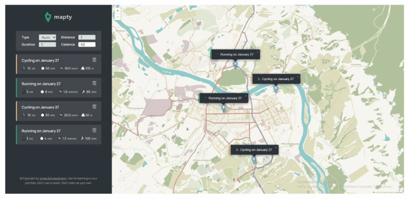

# Mapty

[Demo](https://deniskulik.github.io/mapty/)

## Description

Marty is a vanilla JavaScript application that interacts with the leaflet library and allows you to display training activity on a map. The user can add and remove workouts for running and cycling, and store them in local storage.

## Screenshots

## Getting started

1. Clone Repository
2. `cd mapty`
3. `npm i`
4. `npm run start`